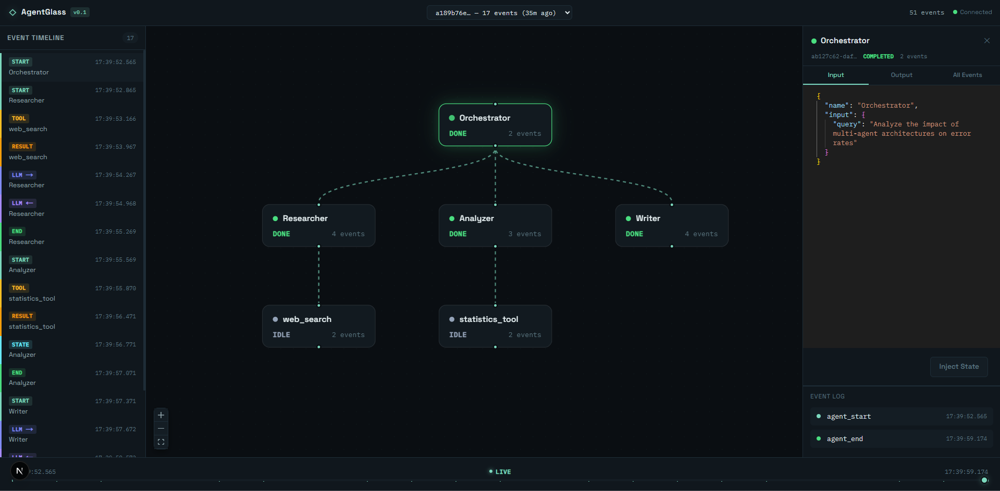

<p align="center">
  
</p>

<h1 align="center">AgentGlass</h1>

<p align="center">
  <strong>Local-first observability, debugging, and evaluation for AI agent systems.</strong>
</p>

<p align="center">
  Trace multi-step agent execution, inspect failures in context, compare runs, and score behavior — without shipping telemetry to the cloud.
</p>

---

## Overview

AgentGlass is an open-source developer workbench for LangGraph and multi-agent workflows. It captures execution as structured events, persists traces locally, and surfaces them through an interactive dashboard and CLI.

The system is designed around a single loop: **observe execution, debug with time-travel context, understand root cause, evaluate quality, and compare variants** — all on your machine.

## Features

- **Distributed tracing** — span-level event capture for agent nodes, tool calls, and LLM requests
- **Live execution graph** — topology visualization with node-level inspection
- **Timeline & time-travel** — scrub through trace history to see state at any point
- **Trace comparison** — side-by-side diff of runs, summaries, and evaluation scores
- **Deterministic evaluation** — reproducible scoring for task completion, tool efficiency, and loop detection
- **Semantic evaluation** — optional local LLM judges via Ollama
- **LangGraph instrumentation** — one-line adapter for Python graphs
- **Local persistence** — SQLite metadata store with blob storage for large payloads
- **Export** — trace export for replay and testing workflows

## Architecture

```text
Agent Application
       │
 AgentGlass SDK (Python / TypeScript)
       │
       ▼
┌──────────────────┐
│  Local Daemon    │  ingestion · validation · analysis · evaluation
└────────┬─────────┘
         │
   SQLite + blobs
         │
    ┌────┴────┐
    ▼         ▼
Dashboard    CLI
```

The daemon receives events over HTTP, validates and stores them, and streams updates to the dashboard over WebSocket. LLM inference remains in your agent runtime; AgentGlass does not proxy model calls.

| Component | Role |
|-----------|------|
| `apps/daemon` | Event ingest, storage, trace summaries, evaluation API |
| `apps/dashboard` | Next.js UI for live graph, timeline, compare, and settings |
| `packages/sdk-ts` | Shared schemas, trace analysis, evaluator engine |
| `packages/cli` | Local stack management and evaluation commands |
| `sdk-python` | Python client, LangGraph adapter, instrumentation helpers |

## Getting Started

### Prerequisites

- Node.js 20+
- pnpm 9+
- Python 3.10+ (for the Python SDK)

### Install

```bash
git clone https://github.com/VishalPainjane/AgentGlass.git
cd AgentGlass
pnpm install
```

### Run the stack

```bash
pnpm dev:up
```

| Service | URL |
|---------|-----|
| Dashboard | http://localhost:3456 |
| Daemon API | http://127.0.0.1:8765 |

### Instrument a Python agent

```bash
cd sdk-python
pip install -e ".[langgraph]"
```

```python
from agentglass_python import AgentGlassClient
from agentglass_python.langgraph_adapter import instrument_langgraph

client = AgentGlassClient()
trace_id = client.start_trace()

graph = instrument_langgraph(your_compiled_graph, client, trace_id=trace_id)
result = graph.invoke(initial_state)

client.close()
```

### Evaluate a trace

```bash
agentglass eval <trace-id>
agentglass eval <trace-id> --semantic
```

## Evaluation

AgentGlass ships a small evaluator framework for scoring completed traces.

| Evaluator | Type | Description |
|-----------|------|-------------|
| `task_completion:v1` | Deterministic | Whether the trace reached a successful terminal state |
| `tool_efficiency:v1` | Deterministic | Tool and retrieval usage against a workflow baseline |
| `loop_detection:v1` | Deterministic | Detection of repeated execution cycles |
| `answer_groundedness:v1` | LLM (Ollama) | Whether the final answer is supported by retrieved evidence |

Evaluators return structured scores with explanations, scope metadata, and pass/fail conditions.

## Development

```bash
pnpm build
pnpm test
pnpm lint
pnpm typecheck
```

## Status

AgentGlass is under active development. Evaluation datasets, experiment batches, multi-tenant deployment, and runtime execution fork are not yet supported. God Mode (live state injection) is experimental and requires agent-side breakpoint integration.

## License

See repository license terms. If no license file is present, contact the maintainers before redistribution.
